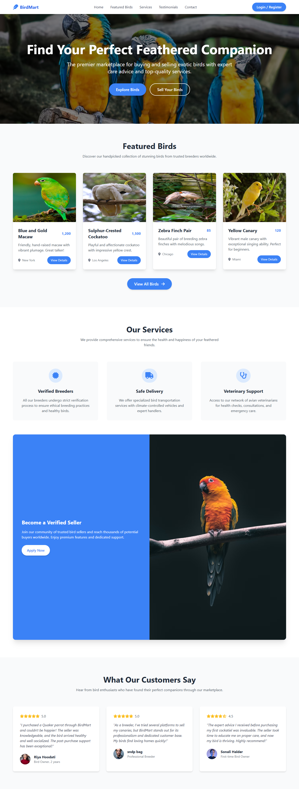

# BirdMart - Exotic Bird Marketplace



## 🦜 Overview

BirdMart is a premium online marketplace dedicated to connecting exotic bird sellers with potential buyers. The platform provides a seamless experience for users looking to buy or sell birds while ensuring ethical breeding practices and proper animal care.

## ✨ Features

### For Buyers
- Browse a curated selection of exotic birds from verified breeders
- Filter search by bird type, location, and price range
- View detailed bird profiles with high-quality photos
- Access expert care guides and information
- Secure payment processing
- Safe bird transportation services

### For Sellers
- Create professional listings for birds
- Verification system to build trust with buyers
- Tools to manage inventory and communications
- Access to a large community of bird enthusiasts
- Support for safe shipping and transportation

### Platform Services
- **Verified Breeders Program**: Rigorous verification process for ethical breeding standards
- **Safe Delivery**: Specialized bird transportation with climate-controlled vehicles
- **Veterinary Support**: Network of avian veterinarians for health checks and consultations

## 🛠️ Technologies Used

- **Frontend**: HTML5, CSS3, JavaScript
- **CSS Framework**: Tailwind CSS
- **Icons**: Font Awesome
- **JavaScript Libraries**: Alpine.js
- **Responsive Design**: Mobile-first approach

## 🚀 Getting Started

### Prerequisites
- Modern web browser (Chrome, Firefox, Safari, Edge)
- Git (for cloning the repository)

### Installation

1. Clone the repository:
   ```bash
   git clone https://github.com/sndpbag/BirdMart.git
   ```

2. Navigate to the project directory:
   ```bash
   cd birdmart
   ```

3. Open `index.html` in your browser:
   ```bash
   # On macOS
   open index.html
   
   # On Windows
   start index.html
   
   # On Linux
   xdg-open index.html
   ```

Alternatively, you can use a local development server like Live Server extension for VS Code.

## 📝 Project Structure

```
birdmart/
├── index.html          # Main HTML file
 
```

## 🎨 Design Decisions

- **Color Scheme**: Blue theme representing trust, reliability, and professionalism
- **Typography**: Clean, readable fonts for optimal user experience
- **Layout**: Responsive grid design that adapts to all screen sizes
- **User Experience**: Intuitive navigation and clear call-to-action buttons

## 🔧 Customization

### Modifying the Theme
1. The color scheme can be adjusted in the Tailwind CSS classes throughout the HTML
2. Main brand colors are defined using Tailwind's blue-500, blue-600 for primary actions

### Adding New Pages
1. Create a new HTML file in the root directory or in the `pages/` folder
2. Copy the header and footer from `index.html` for consistent branding
3. Link the new page in the navigation menu

## 📱 Responsive Design

BirdMart is fully responsive and optimized for:
- Desktop computers
- Tablets
- Mobile phones

The responsive design uses Tailwind CSS's responsive utilities and flexbox/grid layouts.

## 🔒 Privacy & Security Features

- Secure contact form for user inquiries
- Privacy policy and terms of service documentation
- Secure user authentication system (login/register)

## 🤝 Contributing

We welcome contributions to improve BirdMart! Please follow these steps:

1. Fork the repository
2. Create a new branch (`git checkout -b feature/amazing-feature`)
3. Make your changes
4. Commit your changes (`git commit -m 'Add some amazing feature'`)
5. Push to the branch (`git push origin feature/amazing-feature`)
6. Open a Pull Request

## 📄 License

This project is licensed under the MIT License - see the LICENSE file for details.

## 👥 Contact Information

- Website: [sndpbag.github.io/BirdMart/](https://sndpbag.github.io/BirdMart/)
- Email: sndpbagg@gmail.com
- Phone: +91 7980048890
- Address: Amtala, Dakshin Gouripur, 743503

## 🙏 Acknowledgements

- [Tailwind CSS](https://tailwindcss.com/)
- [Alpine.js](https://alpinejs.dev/)
- [Font Awesome](https://fontawesome.com/)
- [Unsplash](https://unsplash.com/) for stock images